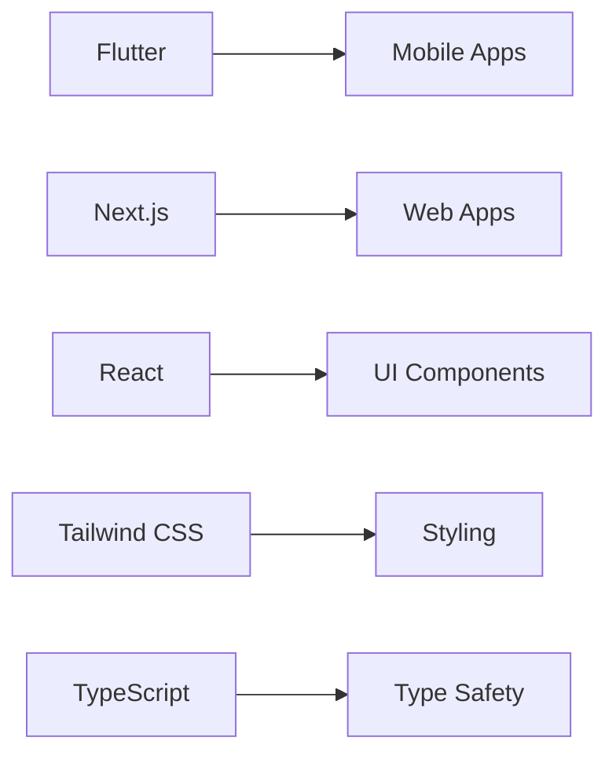
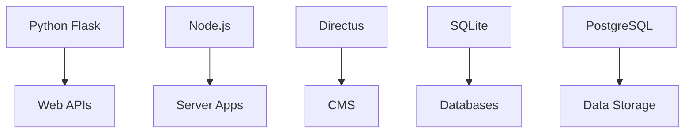

# 🚀 Project Portfolio

Welcome to my comprehensive software development portfolio! This repository showcases a diverse collection of full-stack applications built with modern technologies and best practices.


## 📋 Table of Contents

- [🌐 Live Portfolio](#-live-portfolio)
- [🚀 Featured Projects](#-featured-projects)
- [🛠️ Technology Stack](#️-technology-stack)
- [🏗️ Project Architecture](#️-project-architecture)
- [🚀 Quick Start](#-quick-start)
- [📊 Project Status](#-project-status)
- [🤝 Contributing](#-contributing)
- [📄 License](#-license)

## 🌐 Live Portfolio

[](https://nonshenz007.github.io/portfolio-fullstack-developer/)

**🎉 Your amazing portfolio website is now live!**

Visit your portfolio at: **[https://nonshenz007.github.io/portfolio-fullstack-developer/](https://nonshenz007.github.io/portfolio-fullstack-developer/)**

**Features:**
- ✨ Modern, responsive design with smooth animations
- 🚀 Interactive hero section with code typing effect
- 📱 Mobile-first approach with beautiful UI
- 🎨 Gradient backgrounds and particle effects
- 📊 Skills showcase with animated progress bars
- 🔗 Direct links to all your GitHub projects
- 📧 Contact form with validation
- 🌙 Professional color scheme and typography

**To enable GitHub Pages:**
1. Go to your repository settings
2. Scroll down to "Pages" section
3. Select "Deploy from a branch"
4. Choose "main" branch and "/docs" folder
5. Click "Save"

## 🌟 Featured Projects

### 🛒 ChaiOS - POS Management System

**A comprehensive Point of Sale application for retail businesses**

[](chaio/)
[](chaio/)
[](chaio/)

**Key Features:**
- 📦 **Inventory Management** - Add/edit items with stock tracking and pricing
- 💰 **Sales Processing** - Cash/UPI/Credit payments with bill generation
- 💳 **Credit System (Udar)** - Manual credit creation, payment tracking, reminders
- 📊 **Reports & Analytics** - Period summaries, charts, CSV/PDF exports
- 🔐 **Security Features** - PIN/biometric lock, encrypted backup/restore
- 📱 **Cross-Platform** - Android/iOS/Web deployment

**Tech Stack:** Flutter, Dart, Hive Database, Provider State Management

```bash
# Quick setup
cd chaios
flutter pub get
flutter run
```

---

### ✈️ TripChoice - Travel Package Platform

**Modern travel booking platform with curated packages and WhatsApp integration**

[](tripchoice/)
[](tripchoice/)
[](tripchoice/)
[](tripchoice/)

**Key Features:**
- 🏖️ **Curated Packages** - Goa to Dubai destinations with honest pricing
- 💰 **Dynamic Pricing** - Season/weekend multipliers with flash sales
- 📱 **WhatsApp Integration** - Direct lead generation and customer support
- 🎯 **Personalization** - Client-side preferences and recommendations
- 🔍 **Advanced Search** - Real-time filtering and sorting
- 📊 **SEO Optimized** - Schema.org markup and comprehensive meta tags

**Tech Stack:** Next.js 14, TypeScript, Tailwind CSS, Directus CMS, PostgreSQL

```bash
# Quick setup
cd tripchoice
npm install
cd apps/web
npm install
npm run dev
```

---

### 📄 LedgerFlow - Professional Invoice Generator

**Premium desktop application for generating realistic business invoices**

[](LedgerFlow%20⚠️/)
[](LedgerFlow%20⚠️/)
[](LedgerFlow%20⚠️/)

**Key Features:**
- 📋 **Multiple Templates** - GST (India), Plain (Cash), VAT (Bahrain)
- 📊 **Excel Integration** - Drag-and-drop product catalog import
- 🎨 **Premium UI/UX** - Glassmorphism design with dark/light themes
- 🔒 **Security Features** - Passcode protection and audit logging
- 📈 **Advanced Analytics** - Real-time statistics and progress tracking
- 🚀 **Beginner Onboarding** - Step-by-step setup for new users

**Tech Stack:** Python, Flask, SQLite, HTML/CSS/JavaScript, PDF Generation

```bash
# Quick setup
cd "LedgerFlow ⚠️"
pip install -r requirements.txt
python app.py
```

---

### 🤖 Clara - AI Assistant Framework

**Advanced AI assistant with modular architecture and memory systems**

[](clara/)

**Key Features:**
- 🧠 **Memory Systems** - Persistent conversation history and context
- 🔧 **Modular Architecture** - Extensible plugin system
- 🎯 **Multi-Domain Support** - Specialized knowledge bases
- 📚 **Learning Capabilities** - Continuous improvement through interactions

---

### 🏷️ QuickTags - Document Processing System

**Advanced document tagging and processing platform**

[](quicktags%20✅/)

**Key Features:**
- 📑 **Document Processing** - Automated tagging and categorization
- 🔍 **Smart Search** - Advanced document retrieval
- 📊 **Analytics Dashboard** - Processing statistics and insights
- 🚀 **Batch Processing** - High-volume document handling

---

### 🔍 VeriDoc - Document Verification Platform

**Comprehensive document verification and validation system**

[](VeriDoc/)

**Key Features:**
- ✅ **Document Verification** - Multi-format document validation
- 🔐 **Security Features** - Tamper detection and integrity checks
- 📈 **Large Scale** - Enterprise-grade processing capabilities
- 🎯 **Compliance** - Regulatory compliance and audit trails

## 🛠️ Technology Stack

### Frontend Development


### Backend Development


### DevOps & Tools
- 🐳 **Docker** - Containerization
- 🔄 **Git** - Version Control
- 🚀 **GitHub Actions** - CI/CD
- 📦 **npm/yarn** - Package Management
- 🧪 **Testing Frameworks** - Quality Assurance

## 🏗️ Project Architecture

```
projects/
├── chaios/                 # Flutter POS Application
│   ├── lib/               # Dart source code
│   ├── android/           # Android platform
│   ├── ios/              # iOS platform
│   └── test/             # Unit tests
├── tripchoice/            # Next.js Travel Platform
│   ├── apps/web/         # Next.js application
│   ├── directus/         # CMS configuration
│   └── cypress/          # E2E tests
├── LedgerFlow ⚠️/         # Python Invoice Generator
│   ├── app/              # Flask application
│   ├── templates/        # HTML templates
│   └── static/           # Frontend assets
├── clara/                 # AI Assistant Framework
├── quicktags ✅/          # Document Processing
├── VeriDoc/               # Document Verification
└── docs/                  # Documentation
```

## 🚀 Quick Start

### Prerequisites
- **Python 3.8+** - Backend development
- **Node.js 18+** - Frontend development
- **Flutter SDK** - Mobile development
- **Git** - Version control

### Clone Repository
```bash
git clone https://github.com/yourusername/your-portfolio.git
cd your-portfolio
```

### Setup Individual Projects
```bash
# ChaiOS Setup
cd chaios
flutter pub get

# TripChoice Setup
cd ../tripchoice
npm install
cd apps/web
npm install

# LedgerFlow Setup
cd ../../LedgerFlow
pip install -r requirements.txt
```

## 📊 Project Status

| Project | Status | Technologies | Demo |
|---------|--------|--------------|------|
| **ChaiOS** | ✅ Complete | Flutter, Dart | [Demo](#) |
| **TripChoice** | ✅ Complete | Next.js, TypeScript | [Demo](#) |
| **LedgerFlow** | ✅ Complete | Python, Flask | [Demo](#) |
| **Clara** | 🔄 In Progress | Python, AI | [Demo](#) |
| **QuickTags** | ✅ Complete | Python, ML | [Demo](#) |
| **VeriDoc** | 🔄 In Progress | Python, Security | [Demo](#) |

## 🎯 Key Achievements

### 🏆 Technical Excellence
- **Cross-Platform Development** - Flutter apps running on Android, iOS, Web
- **Modern Web Stack** - Next.js 14 with App Router and TypeScript
- **AI Integration** - Machine learning models for document processing
- **Security First** - Enterprise-grade security implementations

### 🚀 Performance & Scalability
- **Optimized Applications** - Fast loading times and smooth UX
- **Scalable Architecture** - Modular design for easy expansion
- **Database Efficiency** - Optimized queries and data structures

### 🎨 User Experience
- **Intuitive Interfaces** - User-friendly designs with accessibility
- **Responsive Design** - Works seamlessly across all devices
- **Onboarding Flows** - Smooth user introduction and setup

## 🤝 Contributing

I welcome contributions to any of these projects! Here's how you can help:

1. **Fork** the repository
2. **Create** a feature branch
3. **Make** your changes
4. **Test** thoroughly
5. **Submit** a pull request

### Development Guidelines
- Follow existing code style and conventions
- Add tests for new features
- Update documentation as needed
- Ensure cross-platform compatibility

## 📄 License

This portfolio contains multiple projects with different licenses:

- **ChaiOS**: MIT License
- **TripChoice**: MIT License
- **LedgerFlow**: MIT License
- **Clara**: MIT License
- **QuickTags**: MIT License
- **VeriDoc**: MIT License

## 📞 Contact & Support

- **🌐 Portfolio**: [https://nonshenz007.github.io/portfolio-fullstack-developer/](https://nonshenz007.github.io/portfolio-fullstack-developer/)
- **🐙 GitHub**: [https://github.com/nonshenz007](https://github.com/nonshenz007)
- **💼 LinkedIn**: [Your LinkedIn](#)
- **📧 Email**: [your.email@example.com](#)
- **📄 Resume**: [View Resume](#)

---

## 🏆 Skills & Expertise

### Programming Languages


### Frameworks & Libraries


### Tools & Technologies


---

**⭐ Star this repository if you find it helpful!**

*Built with passion for creating amazing user experiences and solving real-world problems.*
