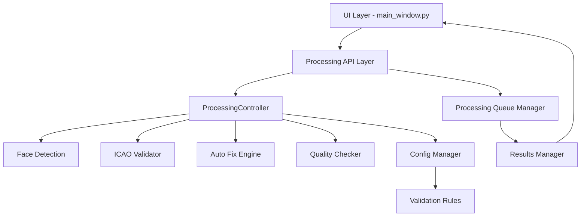
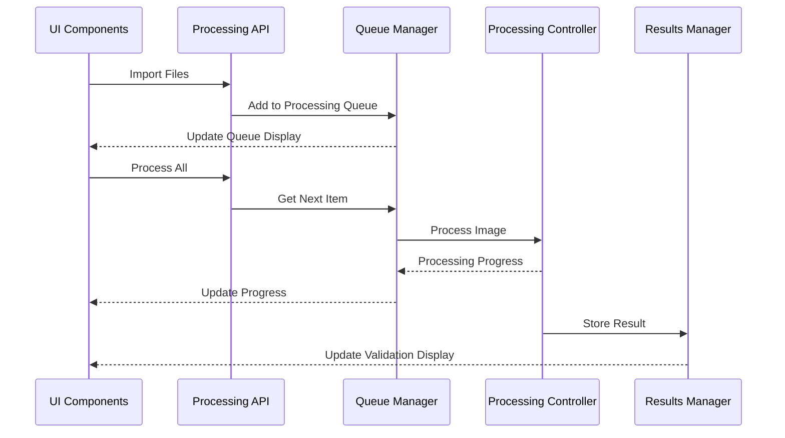

# Design Document

## Overview

The backend processing pipeline bridges the existing UI components with the actual validation and processing functionality. The system will create a unified processing flow that connects UI actions (Import, Process All, Auto Fix, Refresh) to real backend operations including face detection, ICAO compliance validation, and automated fixing.

The design leverages existing components like `ProcessingController`, `VeriDocEngine`, and validation modules while creating new integration layers to handle UI-backend communication effectively.

## Architecture

### High-Level Architecture



### Component Interaction Flow



## Components and Interfaces

### 1. Processing API Layer (`ProcessingAPI`)

**Purpose**: Provides a clean interface between UI components and backend processing.

**Key Methods**:
- `import_files(file_paths: List[str]) -> ImportResult`
- `import_folder(folder_path: str) -> ImportResult`
- `process_image(image_path: str, format_name: str) -> ProcessingResult`
- `process_all_queued() -> BatchProcessingResult`
- `auto_fix_image(image_path: str) -> AutoFixResult`
- `get_validation_results(image_path: str) -> ValidationResult`

**Interface**:
```python
class ProcessingAPI:
    def __init__(self, progress_callback: Optional[Callable] = None)
    def set_progress_callback(self, callback: Callable[[ProcessingProgress], None])
    def import_files(self, file_paths: List[str]) -> ImportResult
    def process_image(self, image_path: str, format_name: str = "ICS-UAE") -> ProcessingResult
    def auto_fix_image(self, image_path: str) -> AutoFixResult
```

### 2. Queue Manager (`ProcessingQueueManager`)

**Purpose**: Manages the processing queue, handles batch operations, and coordinates progress tracking.

**Key Responsibilities**:
- Maintain processing queue state
- Handle batch processing coordination
- Provide progress updates to UI
- Manage processing priorities

**Interface**:
```python
class ProcessingQueueManager:
    def add_images(self, image_paths: List[str]) -> None
    def remove_image(self, image_path: str) -> None
    def clear_queue(self) -> None
    def get_queue_status() -> QueueStatus
    def process_next() -> Optional[ProcessingResult]
    def process_all(self, format_name: str) -> BatchResult
```

### 3. Results Manager (`ProcessingResultsManager`)

**Purpose**: Stores and manages processing results, provides caching for UI display.

**Key Responsibilities**:
- Cache validation results
- Provide fast access to results for UI updates
- Handle result persistence
- Manage result history

**Interface**:
```python
class ProcessingResultsManager:
    def store_result(self, image_path: str, result: ProcessingResult) -> None
    def get_result(self, image_path: str) -> Optional[ProcessingResult]
    def get_all_results(self) -> Dict[str, ProcessingResult]
    def clear_results(self) -> None
    def export_results(self, format: str) -> str
```

### 4. UI Integration Layer (`UIProcessingBridge`)

**Purpose**: Handles UI-specific concerns like progress updates, error handling, and state synchronization.

**Key Responsibilities**:
- Convert backend results to UI-friendly formats
- Handle progress callbacks and UI updates
- Manage error display and user notifications
- Coordinate UI state with backend state

## Data Models

### Processing Progress Model
```python
@dataclass
class ProcessingProgress:
    stage: ProcessingStage
    progress_percent: float
    message: str
    current_image: Optional[str] = None
    images_completed: int = 0
    total_images: int = 0
    estimated_time_remaining: Optional[float] = None
```

### Import Result Model
```python
@dataclass
class ImportResult:
    success: bool
    imported_count: int
    skipped_count: int
    error_count: int
    imported_files: List[str]
    errors: List[str]
    warnings: List[str]
```

### Queue Status Model
```python
@dataclass
class QueueStatus:
    total_items: int
    processed_items: int
    pending_items: int
    current_item: Optional[str]
    is_processing: bool
    estimated_completion_time: Optional[float]
```

### Enhanced Validation Display Model
```python
@dataclass
class ValidationDisplayData:
    image_path: str
    compliance_score: float
    overall_status: ValidationStatus  # PASS, FAIL, NEEDS_IMPROVEMENT
    face_detected: bool
    issues: List[ValidationIssue]
    suggestions: List[str]
    auto_fixable_issues: List[ValidationIssue]
    processing_time: float
    format_used: str
```

## Error Handling

### Error Categories
1. **Import Errors**: File not found, unsupported format, permission issues
2. **Processing Errors**: Face detection failure, validation errors, auto-fix failures
3. **System Errors**: Configuration issues, model loading failures, resource constraints

### Error Handling Strategy
- **Graceful Degradation**: Continue processing other images if one fails
- **User-Friendly Messages**: Convert technical errors to actionable user guidance
- **Error Recovery**: Provide retry mechanisms and alternative processing paths
- **Logging**: Comprehensive error logging for debugging and support

### Error Display in UI
```python
@dataclass
class ProcessingError:
    error_type: ErrorType
    message: str
    user_message: str
    suggestions: List[str]
    is_recoverable: bool
    retry_action: Optional[str]
```

## Testing Strategy

### Unit Testing
- **ProcessingAPI**: Test all API methods with mock backends
- **QueueManager**: Test queue operations, batch processing, progress tracking
- **ResultsManager**: Test result storage, retrieval, and caching
- **UIBridge**: Test UI integration and progress callbacks

### Integration Testing
- **End-to-End Processing**: Test complete pipeline from UI action to result display
- **Batch Processing**: Test processing multiple images with various scenarios
- **Error Scenarios**: Test error handling and recovery mechanisms
- **Progress Tracking**: Test progress updates and UI synchronization

### Performance Testing
- **Large Batch Processing**: Test with 100+ images
- **Memory Usage**: Monitor memory consumption during batch operations
- **Response Time**: Ensure UI remains responsive during processing
- **Concurrent Operations**: Test multiple simultaneous processing requests

### UI Testing
- **Progress Updates**: Verify progress bars and status messages update correctly
- **Error Display**: Test error message display and user guidance
- **State Synchronization**: Ensure UI state matches backend state
- **User Interactions**: Test all UI buttons and actions work correctly

## Implementation Phases

### Phase 1: Core API Layer
- Implement ProcessingAPI class
- Create basic queue management
- Set up progress callback system
- Integrate with existing ProcessingController

### Phase 2: Queue and Results Management
- Implement ProcessingQueueManager
- Create ProcessingResultsManager
- Add result caching and persistence
- Implement batch processing coordination

### Phase 3: UI Integration
- Create UIProcessingBridge
- Update UI components to use new API
- Implement progress display and error handling
- Add real-time status updates

### Phase 4: Enhanced Features
- Implement auto-fix integration
- Add advanced progress tracking
- Create result export functionality
- Optimize performance for large batches