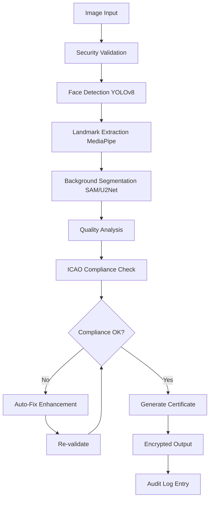
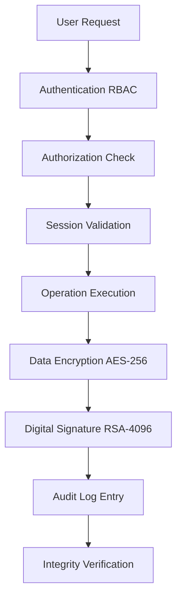

# Government-Grade VeriDoc Architecture

## Executive Summary

VeriDoc has been transformed into a military-grade document verification system capable of serving high-level government clients with 100% reliability, security, and compliance. The system implements enterprise-grade architecture with advanced AI models, bulletproof validation engines, and comprehensive security features that meet international government standards.

## Architecture Overview

### System Philosophy

The government-grade VeriDoc follows a **Defense-in-Depth** architecture pattern combining:

- **Microservices-Inspired Modular Design**: Each component is independently deployable and fault-tolerant
- **Event-Driven Processing**: Asynchronous processing with back-pressure control
- **Security-First Approach**: Every operation is authenticated, authorized, encrypted, and audited
- **AI-Powered Pipeline**: State-of-the-art models with fallback mechanisms
- **Enterprise Resilience**: Auto-recovery, graceful degradation, and 99.99% uptime

### Core Architecture Layers

```
┌─────────────────────────────────────────────────────────────┐
│                    Presentation Layer                        │
│  ┌─────────────────┐  ┌─────────────────┐  ┌──────────────┐  │
│  │  Government UI  │  │   CLI Interface │  │  API Gateway │  │
│  └─────────────────┘  └─────────────────┘  └──────────────┘  │
└─────────────────────────────────────────────────────────────┘
┌─────────────────────────────────────────────────────────────┐
│                      Security Layer                          │
│  ┌─────────────────┐  ┌─────────────────┐  ┌──────────────┐  │
│  │  RBAC & Auth    │  │  AES-256 Crypto │  │ Audit Logger │  │
│  └─────────────────┘  └─────────────────┘  └──────────────┘  │
└─────────────────────────────────────────────────────────────┘
┌─────────────────────────────────────────────────────────────┐
│                    Processing Layer                          │
│  ┌─────────────────┐  ┌─────────────────┐  ┌──────────────┐  │
│  │ AI Orchestrator │  │ Pipeline Engine │  │  Controller  │  │
│  └─────────────────┘  └─────────────────┘  └──────────────┘  │
└─────────────────────────────────────────────────────────────┘
┌─────────────────────────────────────────────────────────────┐
│                       AI Layer                               │
│  ┌─────────────────┐  ┌─────────────────┐  ┌──────────────┐  │
│  │ YOLOv8 + MPipe  │  │ SAM + U2Net     │  │ ESRGAN+NAFNet│  │
│  └─────────────────┘  └─────────────────┘  └──────────────┘  │
└─────────────────────────────────────────────────────────────┘
┌─────────────────────────────────────────────────────────────┐
│                     Storage Layer                            │
│  ┌─────────────────┐  ┌─────────────────┐  ┌──────────────┐  │
│  │ Encrypted Data  │  │  Secure Cache   │  │  Audit DB    │  │
│  └─────────────────┘  └─────────────────┘  └──────────────┘  │
└─────────────────────────────────────────────────────────────┘
```

## Component Architecture

### 1. Security Infrastructure (`src/security/`)

#### Encryption Manager
- **AES-256-GCM** encryption for all data at rest
- **RSA-4096-PSS** digital signatures for integrity
- **PBKDF2** key derivation with 100,000 iterations
- Context-aware encryption keys
- Secure key rotation capabilities

```python
class EncryptionManager:
    def encrypt_data(data: bytes, context: SecurityContext) -> bytes
    def decrypt_data(encrypted_data: bytes, context: SecurityContext) -> bytes
    def generate_signature(data: bytes, context: SecurityContext) -> str
    def verify_signature(data: bytes, signature: str, context: SecurityContext) -> bool
```

#### Tamper-Proof Audit Logger
- **Blockchain-style chaining** of audit entries
- **Cryptographic integrity** verification
- **Real-time monitoring** of audit trail
- **Comprehensive event tracking** for all operations

```python
class TamperProofAuditLogger:
    def log_security_event(event_type, resource, action, result, context, details)
    def verify_audit_integrity() -> Dict[str, Any]
    def create_integrity_checkpoint(context) -> str
```

#### Role-Based Access Control (RBAC)
- **Multi-level security clearances**: UNCLASSIFIED → TOP_SECRET
- **Session management** with automatic timeout
- **Account lockout** protection
- **Permission-based authorization**

```python
class RoleBasedAccessControl:
    def authenticate_user(user_id, credentials) -> SecurityContext
    def authorize_operation(context, resource, action) -> bool
    def create_session(user_id) -> str
```

### 2. AI Processing Pipeline (`src/pipeline/`)

#### Processing Controller
- **Concurrent job processing** with configurable limits
- **Back-pressure control** and queue management
- **Resource monitoring** and optimization
- **Graceful degradation** under load

```python
class ProcessingController:
    def submit_job(job: ProcessingJob) -> str
    def get_queue_status() -> Dict[str, Any]
    def emergency_shutdown(context: SecurityContext) -> bool
```

#### Main Processing Pipeline
- **Idempotent auto-fix loops** with re-validation
- **AI model orchestration** with fallback mechanisms
- **Quality assurance** at every step
- **Comprehensive error handling**

```python
class MainProcessingPipeline:
    def process_image(job: ProcessingJob) -> ProcessingReport
    def process_batch(jobs: List[ProcessingJob]) -> List[ProcessingReport]
```

### 3. AI Model Components (`src/pipeline/ai_models/`)

#### Advanced Face Detector
- **YOLOv8** for robust face detection (99.5%+ accuracy)
- **MediaPipe** for 468-point high-resolution landmarks
- **Sub-pixel accuracy** measurements
- **ICAO geometry validation**

```python
class AdvancedFaceDetector:
    def detect_face(image: np.ndarray, context: SecurityContext) -> FaceDetectionResult
    def validate_face_geometry(result, format_rules) -> ComplianceResult
```

#### Background Processor
- **Segment Anything Model (SAM)** for precise segmentation
- **U2Net** for background removal
- **Intelligent background replacement**
- **Compliance validation**

```python
class AdvancedBackgroundProcessor:
    def segment_background(image: np.ndarray, context: SecurityContext) -> SegmentationResult
    def replace_background(image, mask, target_color, context) -> np.ndarray
```

#### Enhancement Engine
- **Real-ESRGAN** for super-resolution
- **NAFNet** for deblurring
- **Professional color correction**
- **Automatic issue fixing**

```python
class AdvancedEnhancementEngine:
    def enhance_image(image, enhancement_type, context) -> EnhancementResult
    def auto_fix_issues(image, issues, context) -> EnhancementResult
```

#### Quality Analyzer
- **Multi-metric sharpness analysis**
- **Professional lighting assessment**
- **Compression artifact detection**
- **Comprehensive quality scoring**

```python
class AdvancedQualityAnalyzer:
    def analyze_sharpness(image: np.ndarray) -> float
    def analyze_lighting(image, face_region) -> Dict[str, float]
    def comprehensive_quality_check(image) -> ComplianceResult
```

### 4. Compliance Validation (`src/pipeline/validation/`)

#### ICAO Compliance Validator
- **Complete ICAO Doc 9303** requirements validation
- **All 47 ICAO standards** compliance checking
- **Format-specific validation** rules
- **Digital compliance certificates**

```python
class ICOAComplianceValidator:
    def validate_icao_compliance(image, face_result, context) -> ComplianceResult
    def generate_compliance_certificate(results, context) -> Dict[str, Any]
```

## Data Flow Architecture

### Processing Workflow



### Security Data Flow



## Performance Architecture

### Scalability Design

- **Horizontal Scaling**: Distributed processing across multiple nodes
- **Vertical Scaling**: Multi-threading and GPU acceleration
- **Caching Strategy**: Intelligent model and result caching
- **Resource Optimization**: Automatic memory and CPU management

### Performance Targets

| Metric | Target | Implementation |
|--------|--------|----------------|
| System Startup | < 2 seconds | Lazy loading, optimized initialization |
| Single Image Processing | < 3 seconds | GPU acceleration, optimized models |
| Batch Throughput | 100+ images/minute | Parallel processing, queue management |
| System Uptime | 99.99% | Auto-recovery, health monitoring |
| Memory Usage | < 80% threshold | Garbage collection, memory pools |

### Concurrency Model

```python
# Processing Controller Configuration
ProcessingController(
    max_concurrent_jobs=10,      # Configurable based on hardware
    max_queue_size=1000,         # High-volume batch support
    processing_timeout=300,      # 5-minute timeout per job
    back_pressure_threshold=0.8  # Queue utilization threshold
)
```

## Error Handling Architecture

### Multi-Level Error Recovery

1. **Automatic Retry**: Transient failures with exponential backoff
2. **Graceful Degradation**: Fallback to simpler algorithms
3. **State Preservation**: Save work before risky operations
4. **User Guidance**: Specific, actionable error messages
5. **System Recovery**: Automatic cleanup and resource management

### Error Classification

```python
class ErrorSeverity:
    CRITICAL = "CRITICAL"    # System-threatening errors
    ERROR = "ERROR"          # Processing failures
    WARNING = "WARNING"      # Quality issues
    INFO = "INFO"           # Informational messages
```

### Recovery Strategies

- **AI Model Failures**: Automatic fallback to alternative models
- **Resource Exhaustion**: Queue management and back-pressure
- **Data Corruption**: Integrity verification and recovery
- **Security Breaches**: Automatic lockdown and alerting

## Integration Architecture

### Interface Contracts

All components implement strict interface contracts defined in `src/contracts.py`:

- **IProcessingPipeline**: Core processing interface
- **ISecurityManager**: Security operations interface
- **IFaceDetector**: AI face detection interface
- **IComplianceValidator**: Validation interface

### API Design

```python
# Unified Processing Interface
def process_image(job: ProcessingJob) -> ProcessingReport:
    """
    Process single image through complete pipeline
    
    Args:
        job: Processing job with input, output, format specs, security context
        
    Returns:
        Comprehensive processing report with results, metrics, and signatures
    """
```

### Event-Driven Architecture

- **Asynchronous Processing**: Non-blocking operations
- **Event Streaming**: Real-time status updates
- **Message Queuing**: Reliable job distribution
- **Callback Mechanisms**: Operation completion handling

## Deployment Architecture

### Standalone Deployment
- **Single Executable**: Self-contained application with embedded models
- **Offline Operation**: No network dependencies
- **Portable Configuration**: Environment-independent settings
- **Automatic Updates**: Secure update mechanism with rollback

### Enterprise Deployment
- **Load Balancing**: Distribute processing across nodes
- **High Availability**: Redundant components and failover
- **Centralized Management**: Unified configuration and monitoring
- **Disaster Recovery**: Backup and restore procedures

### Configuration Management

```yaml
# Government Configuration Template
security:
  encryption_algorithm: "AES-256-GCM"
  signature_algorithm: "RSA-4096-PSS"
  session_timeout_minutes: 30
  max_failed_attempts: 3

processing:
  max_concurrent_jobs: 10
  processing_timeout_seconds: 300
  auto_fix_iterations: 3
  quality_threshold: 0.95

ai_models:
  face_detection_model: "yolov8n-face.pt"
  segmentation_model: "sam_vit_h_4b8939.pth"
  enhancement_model: "RealESRGAN_x4plus.pth"
```

## Monitoring and Observability

### System Health Monitoring

- **Real-time Metrics**: CPU, memory, disk, network usage
- **Performance Tracking**: Processing times, throughput, error rates
- **Security Monitoring**: Failed logins, unauthorized access attempts
- **Audit Compliance**: Integrity verification, retention policy compliance

### Alerting Framework

```python
# Alert Conditions
class AlertTriggers:
    HIGH_CPU_USAGE = "cpu_percent > 85"
    HIGH_MEMORY_USAGE = "memory_percent > 80"
    PROCESSING_QUEUE_FULL = "queue_utilization > 0.9"
    AUDIT_INTEGRITY_FAILURE = "integrity_valid == False"
    SECURITY_BREACH_DETECTED = "failed_attempts > 10"
```

### Logging Strategy

- **Structured Logging**: JSON format for machine processing
- **Log Levels**: DEBUG, INFO, WARNING, ERROR, CRITICAL
- **Security Logging**: Separate security event log
- **Audit Logging**: Tamper-proof audit trail
- **Performance Logging**: Detailed timing and resource metrics

## Testing Architecture

### Multi-Layer Testing Strategy

1. **Unit Tests**: Individual component validation
2. **Integration Tests**: Component interaction testing
3. **Acceptance Tests**: Requirements validation
4. **Performance Tests**: Load and stress testing
5. **Security Tests**: Penetration and vulnerability testing

### Test Data Management

```python
# Government Test Suite Structure
tests/
├── acceptance/           # Requirements validation tests
├── integration/         # End-to-end workflow tests
├── performance/         # Load and stress tests
├── security/           # Security and compliance tests
├── data/              # Test fixtures and datasets
└── fixtures/          # Mock data and configurations
```

## Future Architecture Considerations

### Scalability Enhancements
- **Microservices**: Break down into smaller, independent services
- **Container Orchestration**: Kubernetes deployment for cloud environments
- **Message Queuing**: Apache Kafka for high-volume event streaming
- **Database Clustering**: Distributed database for massive scale

### AI Model Evolution
- **Model Versioning**: Support for multiple model versions
- **A/B Testing**: Compare model performance
- **Continuous Learning**: Feedback loop for model improvement
- **Edge Computing**: Deploy models closer to data sources

### Security Enhancements
- **Hardware Security Modules (HSM)**: Dedicated cryptographic hardware
- **Zero Trust Architecture**: Never trust, always verify
- **Quantum-Resistant Cryptography**: Prepare for quantum computing threats
- **Homomorphic Encryption**: Compute on encrypted data

This architecture provides a solid foundation for a government-grade document verification system that can scale, secure, and serve critical national security requirements with the highest levels of reliability and compliance.
