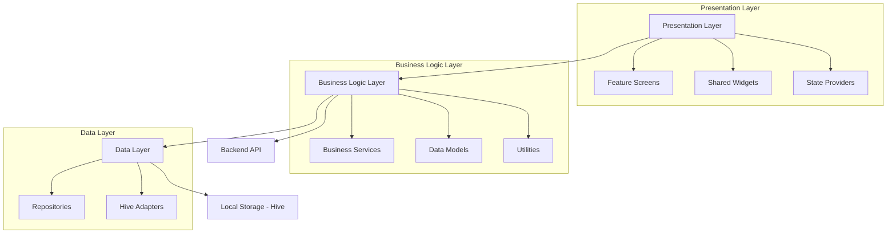

# ChaiOS POS Application - Design Document

## Overview

ChaiOS is a comprehensive Point of Sale application built with Flutter, designed for small businesses with a focus on reliability, offline functionality, and ease of use. The application follows a clean architecture pattern with feature-based organization, local-first data storage using Hive, and a modern Material 3 UI.

## Architecture

### High-Level Architecture



### Feature-Based Organization

```
lib/
├── core/                    # Core utilities and shared components
│   ├── database/           # Hive setup and configuration
│   ├── navigation/         # Navigation utilities
│   ├── services/          # Core services (error handling, logging)
│   ├── utils/             # Utility functions
│   └── widgets/           # Shared UI components
├── features/              # Feature modules
│   ├── sales/             # Sales management
│   ├── inventory/         # Inventory management
│   ├── reports/           # Financial reporting
│   ├── credit/            # Credit management
│   ├── settings/          # App configuration
│   └── bills/             # Bill generation and history
└── theme/                 # Application theming
```

## Components and Interfaces

### Core Components

#### 1. Database Layer
- **HiveService**: Manages database initialization and box operations
- **Repository Pattern**: Abstract data access with concrete implementations
- **Data Models**: Hive-compatible models with type adapters

#### 2. State Management
- **Provider Pattern**: Using Flutter Provider for state management
- **Feature Providers**: Dedicated providers for each feature module
- **Global State**: App-wide state for settings and user session

#### 3. Navigation System
- **AppRouter**: Centralized navigation management
- **Route Guards**: License validation and access control
- **Deep Linking**: Support for QR code bill access

### Feature Components

#### Sales Management
```dart
// Core interfaces
abstract class SalesRepository {
  Future<void> saveSale(Sale sale);
  Future<List<Sale>> getSalesByDateRange(DateTime start, DateTime end);
  Future<Sale?> getSaleByBillNumber(String billNumber);
}

class SalesService {
  Future<Sale> createSale(List<SaleItem> items, PaymentMethod payment);
  Future<void> processCreditPayment(String billNumber, double amount);
  Future<List<Sale>> getTodaySales();
}
```

#### Inventory Management
```dart
abstract class InventoryRepository {
  Future<void> saveItem(InventoryItem item);
  Future<List<InventoryItem>> getAllItems();
  Future<void> updateStock(String itemId, int quantity);
}

class InventoryService {
  Future<void> addItem(InventoryItem item);
  Future<void> updateItemStock(String itemId, int soldQuantity);
  Future<List<InventoryItem>> getLowStockItems();
}
```

#### Report Generation
```dart
class ReportService {
  Future<DailyReport> generateDailyReport(DateTime date);
  Future<WeeklyReport> generateWeeklyReport(DateTime weekStart);
  Future<MonthlyReport> generateMonthlyReport(int month, int year);
  Future<void> exportReportToPDF(Report report, String filePath);
}
```

## Data Models

### Core Models

#### Sale Model
```dart
@HiveType(typeId: 0)
class Sale extends HiveObject {
  @HiveField(0)
  final String billNumber;
  
  @HiveField(1)
  final List<SaleItem> items;
  
  @HiveField(2)
  final double totalAmount;
  
  @HiveField(3)
  final PaymentMethod paymentMethod;
  
  @HiveField(4)
  final DateTime createdAt;
  
  @HiveField(5)
  final DateTime? creditPaidAt;
  
  @HiveField(6)
  final String? customerName;
  
  @HiveField(7)
  final String? customerPhone;
}
```

#### Inventory Item Model
```dart
@HiveType(typeId: 1)
class InventoryItem extends HiveObject {
  @HiveField(0)
  final String id;
  
  @HiveField(1)
  final String name;
  
  @HiveField(2)
  final double sellingPrice;
  
  @HiveField(3)
  final double? costPrice;
  
  @HiveField(4)
  final int currentStock;
  
  @HiveField(5)
  final int minimumStock;
  
  @HiveField(6)
  final DateTime createdAt;
  
  @HiveField(7)
  final DateTime updatedAt;
}
```

### Database Schema

#### Hive Boxes Structure
- **sales_box**: Stores all sale transactions
- **inventory_box**: Stores inventory items
- **settings_box**: Stores app configuration
- **reports_cache_box**: Caches generated reports
- **credit_box**: Stores credit transaction details

## Error Handling

### Error Handling Strategy

#### 1. Layered Error Handling
```dart
// Repository Level
class SalesRepository {
  Future<Sale> saveSale(Sale sale) async {
    try {
      // Database operation
    } on HiveError catch (e) {
      throw DatabaseException('Failed to save sale: ${e.message}');
    }
  }
}

// Service Level
class SalesService {
  Future<Sale> createSale(List<SaleItem> items) async {
    try {
      // Business logic
    } on DatabaseException catch (e) {
      throw SalesException('Unable to create sale: ${e.message}');
    }
  }
}

// UI Level
class SalesProvider {
  Future<void> createSale() async {
    try {
      // Call service
    } on SalesException catch (e) {
      _showErrorToUser(e.message);
    }
  }
}
```

#### 2. Global Error Handler
```dart
class GlobalErrorHandler {
  static void handleError(Object error, StackTrace stackTrace) {
    // Log error
    // Show user-friendly message
    // Report to crash analytics if available
  }
}
```

## Testing Strategy

### Testing Pyramid

#### 1. Unit Tests
- **Model Tests**: Data model validation and serialization
- **Service Tests**: Business logic validation
- **Repository Tests**: Data access layer testing
- **Utility Tests**: Helper function validation

#### 2. Widget Tests
- **Screen Tests**: Individual screen functionality
- **Component Tests**: Reusable widget testing
- **Provider Tests**: State management testing

#### 3. Integration Tests
- **End-to-End Flows**: Complete user journeys
- **Database Integration**: Hive operations testing
- **API Integration**: Backend communication testing

### Test Structure
```dart
// Example test structure
group('SalesService Tests', () {
  late SalesService salesService;
  late MockSalesRepository mockRepository;
  
  setUp(() {
    mockRepository = MockSalesRepository();
    salesService = SalesService(mockRepository);
  });
  
  test('should create sale successfully', () async {
    // Test implementation
  });
  
  test('should handle inventory update on sale', () async {
    // Test implementation
  });
});
```

## Agent Hooks Design

### Hook Configurations

#### 1. Code Quality Hook
```yaml
name: "Code Quality Check"
trigger: "on_file_save"
pattern: "lib/**/*.dart"
description: "Runs linting and formatting on Dart files"
actions:
  - run: "flutter analyze"
  - run: "dart format ."
  - notify: "Code quality check completed"
```

#### 2. Test Automation Hook
```yaml
name: "Auto Test Runner"
trigger: "on_file_save"
pattern: "lib/**/*.dart"
description: "Runs relevant tests when code changes"
actions:
  - run: "flutter test --coverage"
  - generate_report: "coverage/lcov.info"
  - notify: "Tests completed with coverage report"
```

#### 3. Build Validation Hook
```yaml
name: "Build Validator"
trigger: "manual"
description: "Validates app builds for all platforms"
actions:
  - run: "flutter build apk --debug"
  - run: "flutter build web"
  - validate: "No build errors"
  - notify: "Build validation completed"
```

#### 4. Documentation Update Hook
```yaml
name: "Documentation Sync"
trigger: "on_file_save"
pattern: "lib/features/**/*.dart"
description: "Updates API documentation when models change"
actions:
  - generate: "dart doc"
  - update: "README.md with new features"
  - notify: "Documentation updated"
```

## Agent Steering Rules

### Development Standards

#### 1. Code Style Steering
```markdown
---
inclusion: always
---

# ChaiOS Development Standards

## Code Style Guidelines
- Use meaningful variable and function names
- Follow Dart naming conventions (camelCase for variables, PascalCase for classes)
- Add documentation comments for all public APIs
- Maintain consistent indentation (2 spaces)
- Use const constructors where possible for performance

## Architecture Patterns
- Follow the established feature-based architecture
- Use Repository pattern for data access
- Implement Provider pattern for state management
- Separate business logic from UI components
- Use dependency injection for testability

## Error Handling
- Always handle exceptions at appropriate levels
- Provide user-friendly error messages
- Log errors for debugging purposes
- Use custom exception types for different error categories
```

#### 2. Testing Requirements Steering
```markdown
---
inclusion: fileMatch
fileMatchPattern: "test/**/*.dart"
---

# Testing Standards for ChaiOS

## Test Coverage Requirements
- Minimum 80% code coverage for business logic
- All public methods must have unit tests
- Critical user flows must have integration tests
- Mock external dependencies in unit tests

## Test Structure
- Use descriptive test names that explain the scenario
- Follow Arrange-Act-Assert pattern
- Group related tests using `group()` function
- Use `setUp()` and `tearDown()` for test preparation and cleanup

## Test Data
- Use factory methods for creating test objects
- Avoid hardcoded test data where possible
- Create realistic test scenarios that match actual usage
```

#### 3. Performance Guidelines Steering
```markdown
---
inclusion: fileMatch
fileMatchPattern: "lib/**/*.dart"
---

# Performance Guidelines for ChaiOS

## Widget Performance
- Use const constructors for static widgets
- Implement proper `shouldRebuild` logic in custom widgets
- Avoid expensive operations in build methods
- Use `ListView.builder` for large lists

## Database Performance
- Batch database operations where possible
- Use appropriate indexes for Hive boxes
- Implement pagination for large data sets
- Cache frequently accessed data

## Memory Management
- Dispose controllers and streams properly
- Use weak references for callbacks where appropriate
- Avoid memory leaks in long-running operations
```

#### 4. Security Guidelines Steering
```markdown
---
inclusion: manual
contextKey: "security"
---

# Security Guidelines for ChaiOS

## Data Protection
- Encrypt sensitive data in local storage
- Validate all user inputs
- Sanitize data before database operations
- Use secure communication protocols for API calls

## Access Control
- Implement proper license validation
- Use secure session management
- Validate user permissions for sensitive operations
- Log security-related events

## Code Security
- Avoid hardcoded secrets or API keys
- Use environment-specific configurations
- Implement proper error handling without exposing sensitive information
- Regular security audits of dependencies
```

## UI/UX Design Principles

### Material 3 Implementation
- **Color System**: Orange-based theme (#FF8700) with proper contrast ratios
- **Typography**: Clear hierarchy using Material 3 text styles
- **Components**: Consistent use of Material 3 components
- **Spacing**: 8dp grid system for consistent spacing
- **Elevation**: Proper use of elevation for component hierarchy

### Responsive Design
- **Breakpoints**: Support for phone, tablet, and desktop layouts
- **Adaptive Components**: Components that adapt to screen size
- **Navigation**: Bottom navigation for mobile, rail navigation for larger screens
- **Content Layout**: Maximum width constraints for readability

### Accessibility
- **Screen Reader Support**: Proper semantic labels and hints
- **Color Contrast**: WCAG AA compliance for all text
- **Touch Targets**: Minimum 44dp touch targets
- **Keyboard Navigation**: Full keyboard accessibility support

## Performance Considerations

### Database Optimization
- **Lazy Loading**: Load data on demand to reduce memory usage
- **Indexing**: Proper indexing for frequently queried fields
- **Batch Operations**: Group database operations for efficiency
- **Background Processing**: Heavy operations on background isolates

### UI Performance
- **Widget Optimization**: Use const constructors and proper widget lifecycle
- **Image Optimization**: Efficient image loading and caching
- **Animation Performance**: 60fps animations with proper optimization
- **Memory Management**: Proper disposal of resources and controllers

## Security Architecture

### Data Security
- **Local Encryption**: Sensitive data encrypted using Hive encryption
- **Secure Storage**: Critical settings stored securely
- **Data Validation**: Input validation at all entry points
- **Audit Logging**: Security events logged for monitoring

### Network Security
- **HTTPS Only**: All network communications over HTTPS
- **Certificate Pinning**: API certificate validation
- **Request Validation**: Server-side validation of all requests
- **Rate Limiting**: Protection against abuse

This design provides a comprehensive foundation for building a robust, scalable, and maintainable POS application that meets all business requirements while following modern development best practices.